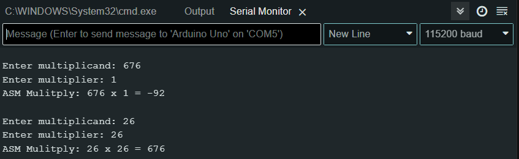
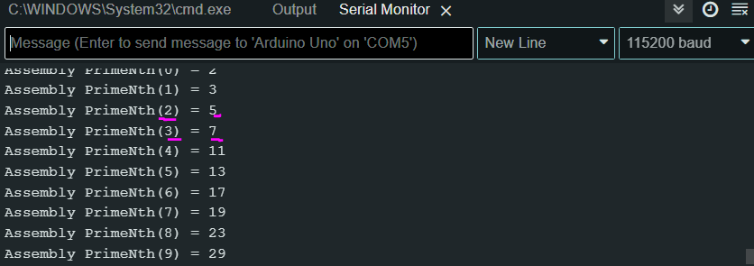

# arduino-c-assembly
C++ and assembly for working with an Arduino Uno R3

# Available Programs
> This repo separates different programs based on branches (this is because Arduino "sketches" are annoying)

| Git branch | Program description | Program notes |
| ---------- | ------------------- | ------------- |
| [**MULTIPLICATION**](https://github.com/evvic/arduino-c-assembly/tree/MULTIPLICATION) | use external assembly with C++ to write a multiplication program |
| [**PRIMES**](https://github.com/evvic/arduino-c-assembly/tree/PRIMES) | use external assembly lookup tables with C++ |
| [**SHARED**](https://github.com/evvic/arduino-c-assembly/tree/SHARED) | alter global external assembly (SRAM memory) variables in C++ program |

# Documents
- [Arduino Uno R3 Documentation](https://docs.arduino.cc/hardware/uno-rev3/)
- [AVR (Assembly) Instruction Set](https://ww1.microchip.com/downloads/en/devicedoc/atmel-0856-avr-instruction-set-manual.pdf)
- [ATMega328 Memory](https://web.alfredstate.edu/faculty/weimandn/miscellaneous/atmega_miscellaneous/ATmega328%20SRAM%20Data%20Memory.pdf)

## Connector Pinouts


## Registers

- According Arduino Uno R3, the registers that correlate to the parameters will be:

| Param 1 | Param 2 | Param 3 | etc... | Return |
| ------- | ------- | ------- | ------ | ------ |
| **r24, r25** | r22, r23 | r20, r21 | continues to go down by 2 registers... | **r24, r25** |

- Notice param 1 and return both use the same registers for this board
    - Therefore the return value will have to be assigned to r25:r24
- The parameters are always going to take 2 register spaces
    - Even if the paramter is just 1 byte

## External Linking
- Functions defined in Assembly are linked with the C++ program with:
```c++
extern "C" int16_t FunctionName(int16_t param1, int16_t param2);
```
- `extern "C"` is used over `extern "C++"`
    - This is because the C++ method will add the params and return type plus a hash to the compiled function name
    - This makes linking more complicated


# Programs 

## Assembly `Multiply` Function
- The function is defined in [`external_assembly_01.ino`](external_assembly_01.ino) as:
```C++
extern "C" int16_t Multiply(int16_t x, int16_t y);
```
- Multiply takes 2 16-bit parameters, and returns a 16-bit value
    - The Arduino Uno registers size are 8 bits, therefore the parameters will take up 2 (adjacent) registers

### Result

- The `Multiply` function uses the AVR assembly [`muls`](https://ww1.microchip.com/downloads/en/devicedoc/atmel-0856-avr-instruction-set-manual.pdf) instruction
    - `muls` takes 2 **8-bit** registers and outputs a **16-bit** product
        - Therefore based on the example there will be an error when providing a parameter greater than 255


## Assembly `PRIMES` Function
- The function is defined in [`external_assembly_01.ino`](external_assembly_01.ino) as:
```C++
extern "C" int8_t PrimeNth(int8_t number);
```
- PrimeNth takes 1 8-bit parameter (an index), and returns a 8-bit value (a prime)
- The `PrimeNth` assembly function utilizes a lookup table/array to store the first 16 prime numbers:
```S
primeTable:
  ;indx 0 1 2 3 4  5  6  7  8  9  10 11 12 13 14 15
  .byte 2,3,5,7,11,13,17,19,23,29,31,37,41,43,47,53
```
- This array of integers is saved in memory and able to be indexed
    - Done so by incrementing the address by `n` byte(s)

### Result


- Providing an index (0 <= index < 16) outputs the prime number at that index in the lookup table

## Assembly `SHARED` Function
- The function and **shared global variables** is defined in [`external_assembly_01.ino`](external_assembly_01.ino) as:
```C++
extern "C" int16_t PlayerFitness();

// External values from Assembly
extern volatile uint8_t powerLevel;
extern volatile uint8_t livesLeft;
```
- `PlayerFitness` fucntion takes no parameters but returns a 16-bit integer
    - It simply multiples the `powerLevel` and `livesLeft` amd returns the product

The global shared variables are declared in Assembly [`asm.S`](asm.S) `.data` section:
```s
.data  

.comm powerLevel, 1
.global powerLevel

.comm livesLeft, 1
.global livesLeft
```
- Here they are declared as 1-byte
- The variables cannot be initialized with values here

### Result