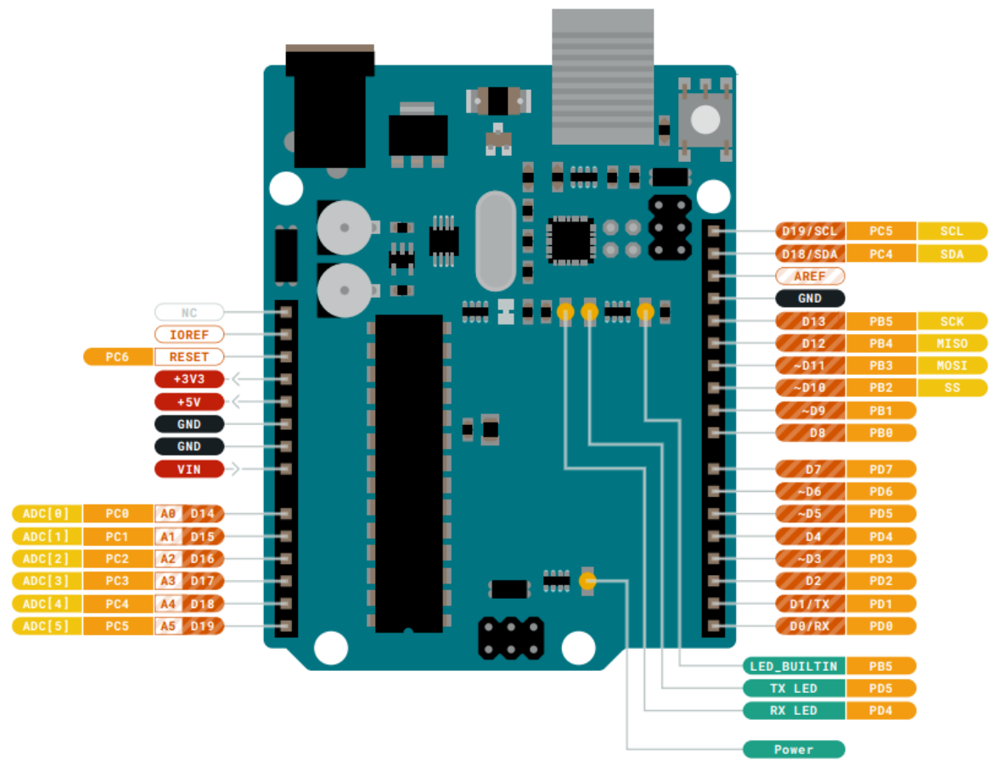

# arduino-c-assembly
C++ and assembly for working with an Arduino Uno R3
> [ARDUINO UNO R3 DOCUMENTATION](https://docs.arduino.cc/hardware/uno-rev3/)

### Connector Pinouts


## Multiplication program
- The git branch [**MULTIPLICATION**](https://github.com/evvic/arduino-c-assembly/tree/MULTIPLICATION) shows how to use external assembly with C++ to write a multiplication program

## Assembly `Multiply` Function
- The function is defined in [`external_assembly_01.ino`](external_assembly_01.ino) as:
```C++
int16_t Multiply(int16_t x, int16_t y);
```
- Multiply takes 2 16-bit parameters, and returns a 16-bit value
    - The Arduino Uno registers size are 8 bits, therefore the parameters will take up 2 (adjacent) registers

- According Arduino Uno R3, the registers that correlate to the parameters will be:

| Param 1 | Param 2 | Param 3 | etc... | Return |
| ------- | ------- | ------- | ------ | ------ |
| **r24, r25** | r22, r23 | r20, r21 | continues to go down by 2 registers... | **r24, r25** |

- Notice param 1 and return both use the same registers for this board
    - Therefore 